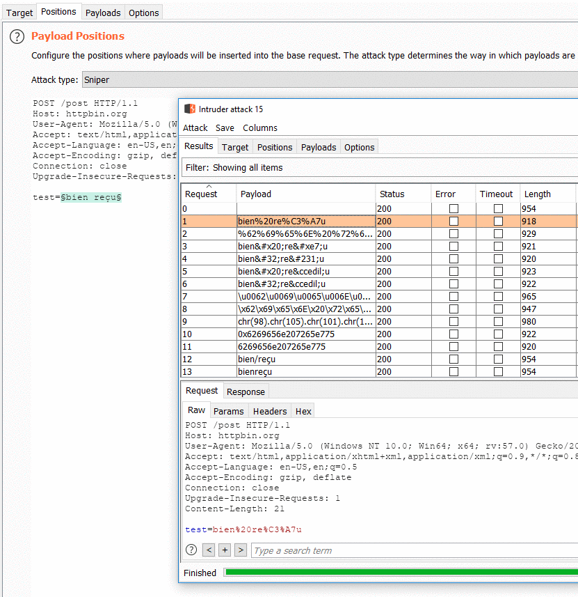

# Encoding Material

## Common formats

### Case mapping

It is sometimes possible to change the expected case mapping. It  will  bypass WAF rules that are case sensitive. Here is an example of htaccess misconfiguration. htaccess is not a WAF per say but it represent what WAF custom rules be.

=== "Improper .htaccess"

    ```js
    RewriteCond %{QUERY_STRING} \bwp/v2/users\b
    ```

=== "Correct .htaccess"

    ```js
    RewriteCond %{QUERY_STRING} \bwp/v2/users\b [NC]
    ```

| **URL** | **Result** |
| --- | --- |
| https://blog.*****.com/section/news?rest_route=/wp/v2/users	| BLOCKED |
| https://blog.*****.com/section/news?rest_route=/wp/v2/usErs	| OK |


Source code handling the `rest_route` parameter.

```php hl_lines="2"
foreach ( $routes as $route => $handlers ) {
    $match = preg_match( '@^' . $route . '$@i', $path, $matches );

    if ( ! $match ) {
        continue;
    }

    $args = array();
```

### URL encoding

TODO

### HTML/XSS specific

If you are testing for potential XSS, the payload you are sending to the webserver could targeted for different context in the page. Based on the potential location you could used context specific encoding.

| **Encoding Type** | **Context** | **"** |**<** |
| --- | --- | --- | --- |
| Named XML/HTML entities | Value is read from the DOM | `&quote;` | `&lt;` |
| Hex XML/HTML entities | Value is read from the DOM | `&#x22;` / `&#34;` | `&x3C;` / `&#60;` |
| Slash escaped | Value inside Javascript variable |  `\x22` , `\042`, `\42` |  |
| String.fromCharCode | Value inside Javascript variable |  `String.fromCharCode(34)` | `String.fromCharCode()` |

!!! info "Purpose"

    All those encodings may allow you bypass keywords or characters blacklist.

### Unicode


### Unicode normalization


## Burp Extensions

### HackVertor

With this extension you can use an XML tags to represent encoding. Instead of encoding manually data and placing it in your request, you can build readable requests.

=== "HackVertor syntax"

    ```xml
    message=<@urlencode_2><@/urlencode_2>
    ```

=== "Corresponding value"

    ```
    message=%3Cimg%20src%3D'x'%20onerror%3D'prompt(1)'%2F%3E
    ```

 - [Official website](https://hackvertor.co.uk/)
 - [Burp extension page](https://portswigger.net/bappstore/65033cbd2c344fbabe57ac060b5dd100)

### Fuzzy Encoding Generator

This extension integrate in Burp Intruder. It will re-encode in various forms the value place between parameter delimiters `§§`.



 - [Github repository](https://github.com/GoSecure/burp-fuzzy-encoding-generator)

