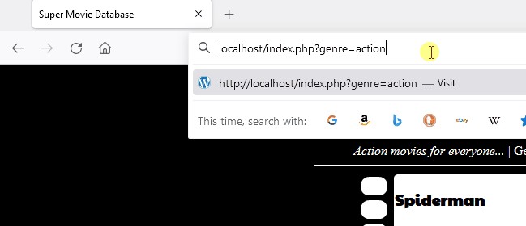
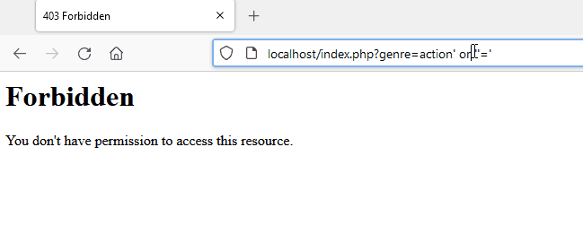

# SQL Syntax Material


## Detection

It is possible to identify SQL injection small expressions.


??? info "How to detect SQL injection"

    |            | MySQL      | SQLite     | MSSQL      | Oracle     | PostgreSQL | DB2        |
    | ---------- | ---------- | ---------- | ---------- | ---------- | ---------- | ---------- |
    | `ad'+'min`    | 0        | 0         | admin      | ⛔        | ⛔         | ⛔         |
    | `ad'||'min`    | 0       | 0         | ⛔        | admin      | admin       | admin      |
    | `ad'||chr(109)||'in` | ⛔ | ⛔      | ⛔        | admin      | admin       | admin      |
    | <nobr>`ad'||char(109)||'in`</nobr> | 0 | admin    | ⛔        | ⛔        | ⛔          | ad109in        |

    ⛔: The query will throw an error.

    - Source: [SQL Injection Is Still Alive](https://gosecure.github.io/presentations/2021-11_sql-injection-is-still-alive/Marc_Olivier_Bergeron-SQL_Injection_Is_Still_Alive-From_a_Malls_Interactive_Terminal_to_AWS_WAF_Bypass.pdf) (Page 30) by Marc-Olivier Bergeron

## White space

Whitespace alternatives by DBMS

| DBMS | ASCII Characters in hexadicimal |
| ---- | ------------------------------- |
| MySQL	5 | 09, 0A, 0B, 0C, 0D, A0, 20 |
| MySQL	3	| 01, 02, 03, 04, 05, 06, 07, 08, 09, 0A, 0B, 0C, 0D, 0E, 0F, 10, 11, 12, 13, 14, 15, 16, 17, 18, 19, 1A, 1B, 1C, 1D, 1E, 1F, 20, 7F, 80, 81, 88, 8D, 8F, 90, 98, 9D, A0 |
| SQLite | 0A, 0D, 0C, 09, 20 |
| MSSQL | 01, 02, 03, 04, 05, 06, 07, 08, 09, 0A, 0B, 0C, 0D, 0E, 0F, 10, 11, 12, 13, 14, 15, 16, 17, 18, 19, 1A, 1B, 1C, 1D, 1E, 1F, 20 |
| PostgreSQL | 0A, 0D, 0C, 09, 20 |
| Oracle 11g | 00, 0A, 0D, 0C, 09, 20 |

- Source:  [SQLi Optimization and Obfuscation Techniques](https://paper.bobylive.com/Meeting_Papers/BlackHat/USA-2013/US-13-Salgado-SQLi-Optimization-and-Obfuscation-Techniques-Slides.pdf) (Page 70) by Roberto Salgado

## Query Obfuscation

Here are few additional tricks taken from [Roberto Salgado paper](https://paper.bobylive.com/Meeting_Papers/BlackHat/USA-2013/US-13-Salgado-SQLi-Optimization-and-Obfuscation-Techniques-Slides.pdf).

### Comments

An alternative to the single characters is using empty comments.

```sql
SELECT/**/name/**/FROM/**/users/**/WHERE/**/1=1
```

### MSSQL [Square brackets]

Microsoft DBMS allow table name to be surrounded by square brackets. Column names can be surrounded by double quotes.

```sql
SELECT"name"FROM[sys.databases]WHERE 1=1
```

### Oracle Hex Encode

Oracle column names can be hex encoded.

```sql
SELECT 0x7461626c655f6e616d65 FROM all_tab_tables
```


## Scientific expression in MySQL (libinjection)

When MySQL sees `1.e(abc)`, it will ignore the `1.e(` portion because the following characters do not form a valid numeric value.

This behavior can be abused to fool libinjection tokenizer. Libinjection internally tokenizes the parameter and identifies contextual section types such as comments and strings. Libinjection sees the string `1.e` as an unknown SQL keyword and concludes that it is more likely to be an English sentence than code. When libinjection is unaware of an SQL function the same behavior can be exhibited.

### Attack in action

Here is a demonstration of modsecurity’s capability to block a malicious pattern for SQL injection. A forbidden page is returned which is the consequence of detection.



In the following image, you can see the original request being slightly modified to bypass modsecurity and libinjection.




Source: [A Scientific Notation Bug in MySQL left AWS WAF Clients Vulnerable to SQL Injection](https://www.gosecure.net/blog/2021/10/19/a-scientific-notation-bug-in-mysql-left-aws-waf-clients-vulnerable-to-sql-injection/)