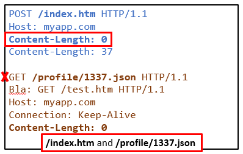
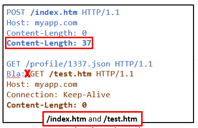

# Request Smuggling Material


## HTTP/1.1 CL.CL

### Duplicate Content-Length (CL.CL)

The first edge case that was documented was the use of two `Content-Length` headers with conflicting values. This cause issue when the proxy and the backend do not use the same value. How can this be possible? Because the parsers are implemented differently, one implementation might keep the last seen header while an other could keep the first one.

*Implementation where the last value is kept*
```python
headers = {}
for line : httpRequest
    parts = line.split(":")
    headers[parts[0]] = parts[1]
```


*Implementation where the first value is kept*
```python
headers = {}
for line : httpRequest
    parts = line.split(":")
    if(parts[0] in headers): #Does not override existing value
        headers[parts[0]] = parts[1]
```

### What each party sees in a CL.CL attack

The proxy **use the first** header:



The backend application **use the last** header:



### There is more...

This scenario is probably the easiest to understand. This is why it was presented first. However, the length of the request is **not defined only by Content-Length**. HTTP has evolved greatly and has multiple headers that cover similar features.


## HTTP/1.1 CL.TE


### HTTP/1.1 Content-Length Transfer-Encoding (CL.TE)

`Content-Length` is not the only one that can be used in an HTTP/1.1 request.

### Chunked encoding

Positive
: “Chunked encoding is useful when larger amounts of data are sent to the client and the total size of the response may not be known until the request has been fully processed.” Ref: [Mozilla.org: Transfer-Encoding](https://developer.mozilla.org/en-US/docs/Web/HTTP/Headers/Transfer-Encoding)

It can be used to serve large files generated on the fly. An example can be seen below. The length is in hexadecimal followed by the bytes "chunk".

```yaml
HTTP/1.1 200 OK
Content-Type: text/plain
Transfer-Encoding: chunked

5\r\n
Hello\r\n
8\r\n
NorthSec\r\n
B\r\n
Conference!\r\n
0\r\n
\r\n
```

The same transfer-encoding type can be used to format the request.

```yaml
POST /index.php HTTP/1.1
Host: myapp.com
Transfer-Encoding: chunked

5\r\n
Hello\r\n
8\r\n
NorthSec\r\n
B\r\n
Conference!\r\n
0\r\n
\r\n
```

### Content-Length vs Transfer-Encoding

The server now has an additional dilemma if both `Content-Length` and `Transfer-Encoding` are present. Which one should be used? Luckily, the HTTP/1.1 RFC is describing the expected scenario.

!!! info "From the RFC"

    “If a message is received with both a Transfer-Encoding header field and a Content-Length header field, the latter MUST be ignored.”
    Ref: [RFC2616 - HTTP/1.1](https://datatracker.ietf.org/doc/html/rfc2616)

`Transfer-Encoding` must be used instead of Content-Length. However `Transfer-Encoding` might not be supported by both services. In 2021, that would be a major oversight.


