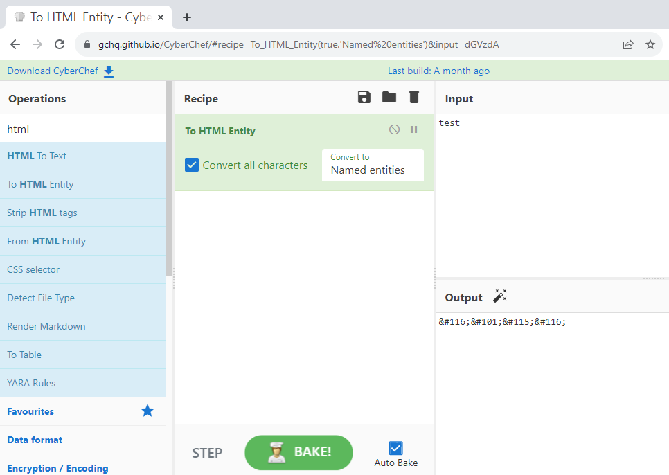

# Encoding Material

## Common formats

### Case mapping

It is sometimes possible to change the expected case mapping. It  will bypass WAF rules that are case-sensitive. Here is an example of `.htaccess` misconfiguration. htaccess is not a WAF per se but it represents what WAF custom rules be.

=== "Improper .htaccess"

    ```js
    RewriteCond %{QUERY_STRING} \bwp/v2/users\b
    ```

=== "Correct .htaccess"

    ```js
    RewriteCond %{QUERY_STRING} \bwp/v2/users\b [NC]
    ```

| **URL** | **Result** |
| --- | --- |
| https://blog.*****.com/section/news?rest_route=/wp/v2/users	| BLOCKED |
| https://blog.*****.com/section/news?rest_route=/wp/v2/usErs	| OK |


Source code handling the `rest_route` parameter.

```php hl_lines="4"
<?php
...
foreach ( $routes as $route => $handlers ) {
    $match = preg_match( '@^' . $route . '$@i', $path, $matches );

    if ( ! $match ) {
        continue;
    }

    $args = array();
```

Source: [6 ways to enumerate WordPress Users](https://www.gosecure.net/blog/2021/03/16/6-ways-to-enumerate-wordpress-users/)

### URL encoding

HTTP GET and POST parameters are expected to be encoded by Web Application Firewall. But what happens if the application decodes the value once it has already been decoded by the web framework? This additional decoding is unlikely to break anything with normal input.

Here are a few examples:

**Path encoded**
```url
http://server.com/cgi/%252E%252E%252F%252E%252E%252Fwinnt/system32/cmd.exe?/c+dir+c:\
```

**HTML double encoded**
```url
%253Cscript%253Econfirm()%253C%252Fscript%253E
```

Examples are taken from: [How to Bypass WAF. HackenProof Cheat Sheet](https://hacken.io/researches-and-investigations/how-to-bypass-waf-hackenproof-cheat-sheet/)

### HTML/XSS specific

If you are testing for potential XSS, the payload you are sending to the webserver could be targeted for different contexts in the page. Based on the potential location you could use context-specific encoding.

| **Encoding Type** | **Context** | **"** |**<** |
| --- | --- | --- | --- |
| Named XML/HTML entities | Value is read from the DOM | `&quote;` | `&lt;` |
| Hex XML/HTML entities | Value is read from the DOM | `&#x22;` / `&#34;` | `&x3C;` / `&#60;` |
| Slash escaped | Value inside Javascript variable |  `\x22` , `\042`, `\42` | `\x3C` , `\074`, `\74` |
| String.fromCharCode | Value inside Javascript variable |  `String.fromCharCode(34)` | `String.fromCharCode(74)` |

!!! info "Purpose"

    All those encodings may allow you to bypass keywords or characters blacklist.

### Unicode

Unicode is not the only way to encode characters

 - UTF-7 (`+ADw-script+AD4-alert(123)+ADw-+AC8-script+AD4-`) ⚠️
 - UTF-16LE (`00 3c 00 62 00 6f 00 6f 00 6b`)
 - UTF-16BE
 - UTF-32…

⚠️: No longer supported by many browsers and frameworks.

More info: [Unicode vulnerabilities that could byͥte you](https://gosecure.github.io/presentations/2021-02-unicode-owasp-toronto/philippe_arteau_owasp_unicode_v4.pdf)

### Unicode Normalization

| Character | Code point |
| -- | --------- | 
| ＜ | (U+FF1C) |
| <  | (U+003C) |

SQL query:
```sql
INSERT INTO ContentTable VALUES (…,'＜img src=…')
```

Content when fetch:
```xml

```

More info: [XSS for ASP.net developers](https://www.gosecure.net/blog/2016/03/22/xss-for-asp-net-developers/)

## Tools

### Cyberchef

A nice web-based interface that allows you to chain multiple encoding types.


<figure markdown>

<figcaption>CyberChef in action</figcaption>
</figure>

### HackVertor (Burp Extension)

With this extension, you can use XML tags to represent encoding. Instead of encoding manually data and placing it in your request, you can build readable requests. It has a better selection of encoding since it is focused on web security rather than general formats.

=== "HackVertor syntax"

    ```xml
    message=<@urlencode_2><@/urlencode_2>
    ```

=== "Corresponding value"

    ```
    message=%3Cimg%20src%3D'x'%20onerror%3D'prompt(1)'%2F%3E
    ```

 - [Official website](https://hackvertor.co.uk/)
 - [Burp extension page](https://portswigger.net/bappstore/65033cbd2c344fbabe57ac060b5dd100)

### Fuzzy Encoding Generator (Burp Extension)

This extension integrates with Burp Intruder. It will re-encode in various forms the value placed between parameter delimiters `§§`.

<figure markdown>

<figcaption>Fuzzy Encoding Generator in action</figcaption>
</figure>


[Fuzzy Encoding Github repository](https://github.com/GoSecure/burp-fuzzy-encoding-generator)

