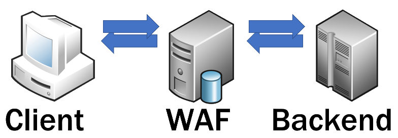
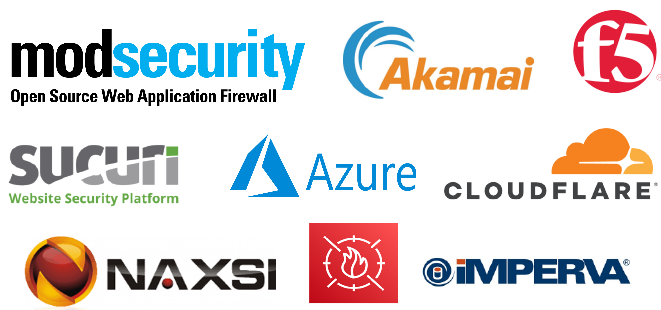

# What is a WAF?

## Context

In a typical scalable web infrastructure, a proxy will place in front of the backend. The proxy is forwarding a request to the backend. It can be a load balancer, a caching server, or simply a reverse proxy. A firewall functionality can be enabled on each of those.

## Purpose

The purpose of the Web Application Firewall is to filters, monitors, and blocks incoming and/or outgoing HTTP traffic.

Analysis of incoming traffic can be to identify attack patterns to block or logged those.

## Vendors

There are numerous WAF softwares that can be used. Many of those are included in cloud infrastructure.

The two main open-source projects are [modsecurity](https://github.com/SpiderLabs/ModSecurity) and [naxsi](https://github.com/nbs-system/naxsi).

